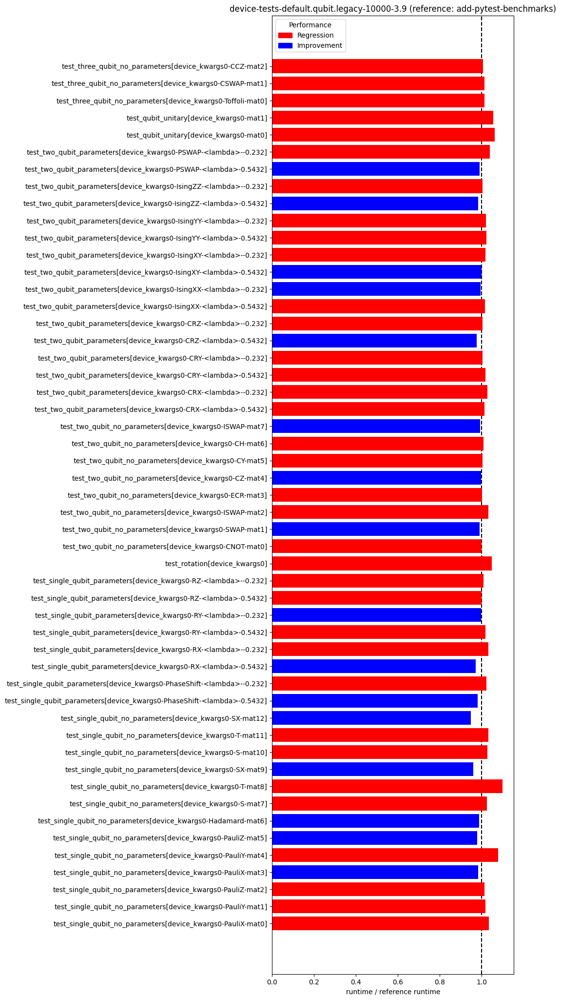
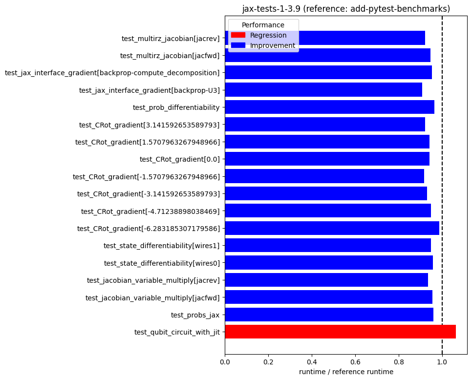

pennylane-benchmarks
====================
  
Performs periodic benchmark runs on PennyLane.  
Last updated: 2023-12-29  

# PennyLane Benchmarks
  
Benchmark reference head commit: [a805bae](https://github.com/PennyLaneAI/pennylane/commit/a805baedacc1c4d6d996627db1c20c4854fd6782)  
Benchmark head commit: [2f437f8](https://github.com/PennyLaneAI/pennylane/commit/2f437f8e8f61d0a06dd1fb170b02f9b246d24c54)  
  
  
  
  
  
  
  
  
  
  
