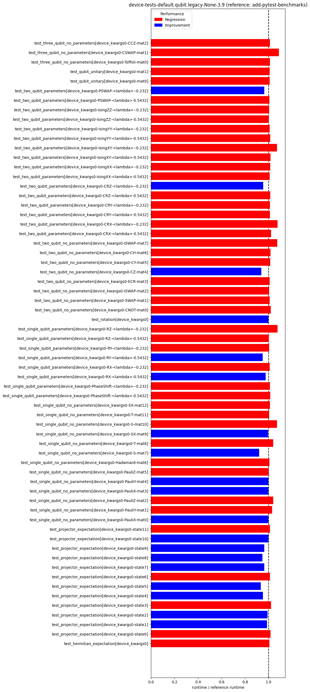

pennylane-benchmarks
====================
  
Performs periodic benchmark runs on PennyLane.  
Last updated: 2023-12-05  

# PennyLane Benchmarks
  
Benchmark reference head commit: [bbb](https://github.com/PennyLaneAI/pennylane/commit/bbb)  
Benchmark head commit: [aaa](https://github.com/PennyLaneAI/pennylane/commit/aaa)  
  
  
  
  
  
  
  
  
  
  
