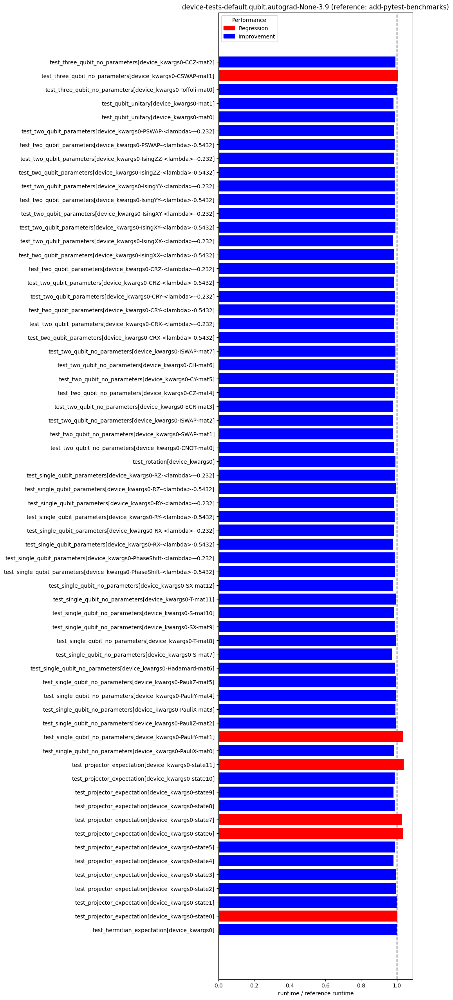

pennylane-benchmarks
====================
  
Performs periodic benchmark runs on PennyLane.  
Last updated: 2024-01-17  

# PennyLane Benchmarks
  
Benchmark reference head commit: [a805bae](https://github.com/PennyLaneAI/pennylane/commit/a805baedacc1c4d6d996627db1c20c4854fd6782)  
Benchmark head commit: [e264f4f](https://github.com/PennyLaneAI/pennylane/commit/e264f4fb33744edea77e484406c20bc960ff6abb)  
  
  
  
  
  
  
  
  
  
  
